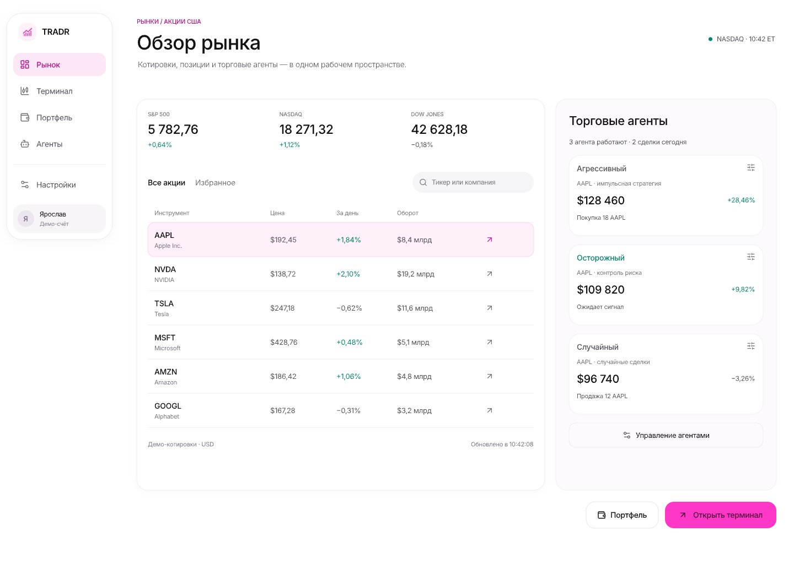
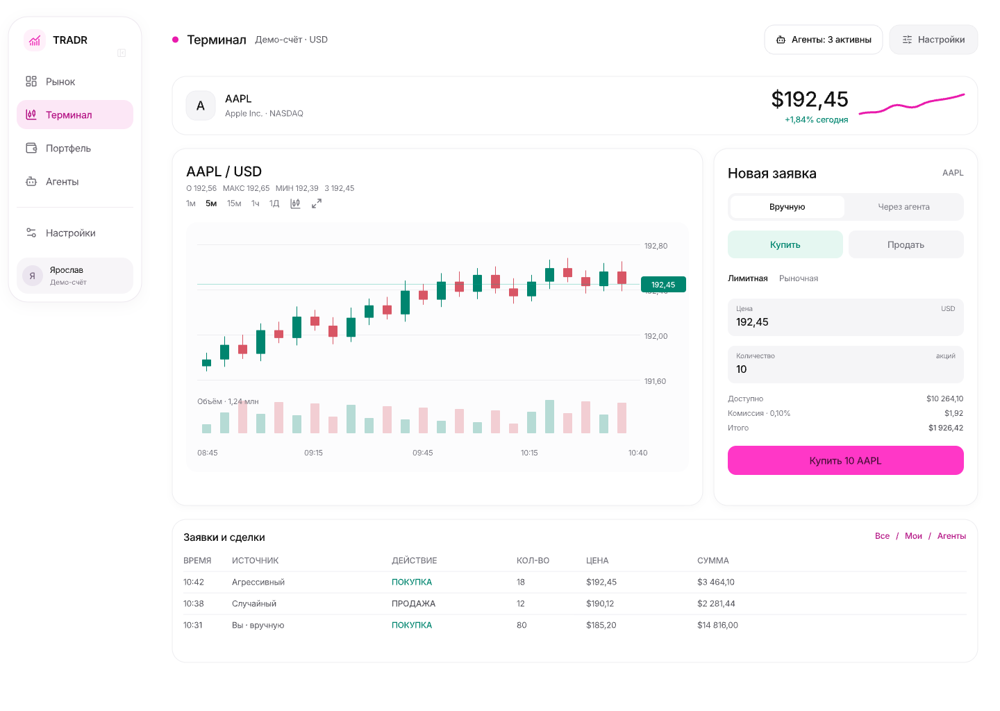
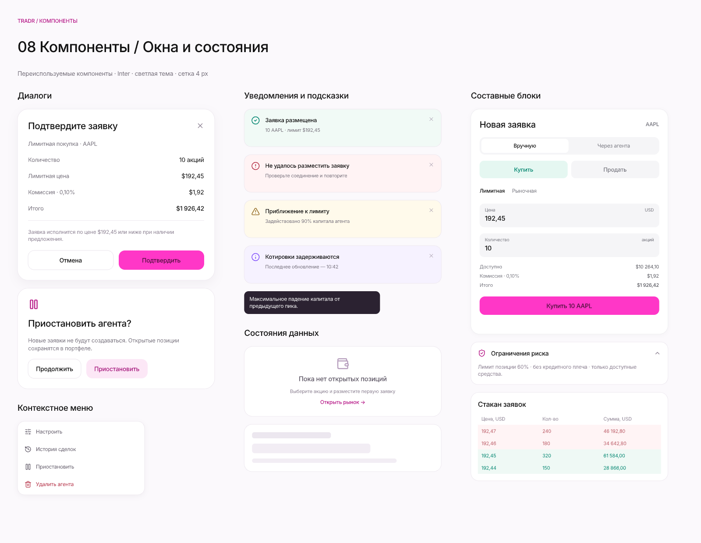

<p align="center">
  
</p>

<p align="center">
  <a href="#экраны">Экраны</a> · <a href="#как-это-работает">Как это работает</a> · <a href="#макет">Макет</a>
</p>

## Что это

TRADR — дизайн-концепт учебной биржи. Пользователь наблюдает за рынком и сравнивает решения трёх торговых агентов на одинаковых данных:

- агрессивный — чаще входит в сделки и использует больший объём;
- осторожный — ждёт подтверждённый сигнал и ограничивает риск;
- случайный — действует случайно как контрольная группа.

Проект не использует реальные деньги и не является торговой рекомендацией.

## Экраны

<p align="center">
  
</p>

<p align="center">
  
</p>

<p align="center">
  
</p>

В макете подготовлены рынок, терминал, портфель, торговые агенты, настройка агентов, история сделок, симуляция в реальном времени, вход, регистрация, загрузка данных и библиотека компактных окон.

## Как это работает

<p align="center">
  
</p>

1. Система получает цену акции на очередном шаге симуляции.
2. Каждый агент принимает своё решение: купить, продать или ждать.
3. Симулятор обновляет баланс, позицию и историю сделок.
4. Результат отображается в капитале, рейтинге агентов и журнале решений.

## Макет

Редактируемый файл Pen: [design.pen](./design/design.pen).

Откройте его в [Pen](https://pen.dev/) для просмотра всех экранов и компонентов.

## Структура репозитория

```
tradr/
  apps/
    web/       # Next.js фронтенд (макет + постепенно живые экраны)
    backend/    # Java/Spring Boot бэкенд — план в apps/backend/docs/
  design/
    design.pen        # редактируемый макет (Pen)
    assets/            # картинки для README и т.п.
    design-previews/    # экспортированные превью экранов
    logo-export/        # экспорт логотипа
  README.md
```

## Статус

`apps/web` — полный UI/UX-макет и дизайн-система (Next.js), пока на тестовых данных. `apps/backend` — Java/Spring Boot бэкенд, план разработки по фазам в `apps/backend/docs/` (`00-overview.md` — с чего начать). Реализация интерактивной симуляции и торговой логики на реальных данных — в процессе.
