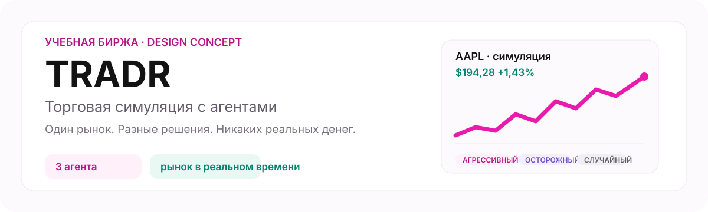
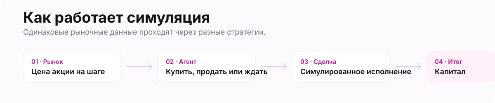

<p align="center">
  
</p>

<p align="center">
  <a href="#быстрый-старт">Быстрый старт</a> · <a href="#возможности">Возможности</a> · <a href="#как-устроен-проект">Архитектура</a> · <a href="#документация">Документация</a> · <a href="https://github.com/Hqzdev/tradr">GitHub</a>
</p>

## Учебная торговая среда с автономными агентами

TRADR — full-stack симулятор рынка. Пользователь начинает со 100 000 учебных
долларов, задаёт цель, распределяет капитал между агентами и наблюдает, как
они самостоятельно покупают и продают акции. Ручной торговли нет: каждое
действие связано с агентом и имеет понятное объяснение.

Проект предназначен для обучения и экспериментов. Он не использует реальные деньги и не является инвестиционной рекомендацией.

## Возможности

- Обзор: общий капитал, прибыль или убыток, резерв и прогресс к цели +10%.
- Рынок: 18 учебных акций, свечи, индексы и WebSocket-обновления.
- Агенты: отдельные кошельки и позиции, три стратегии и полный цикл покупки и продажи.
- Контроль: запуск, пауза, изменение бюджета и безопасное закрытие агента.
- Прозрачность: история сделок, комиссия, причина решения и кривая капитала.

<p align="center">
  
</p>

## Быстрый старт

### Что потребуется

- Node.js 20 или новее;
- Java 21;
- Docker и Docker Compose для PostgreSQL.

### Первый запуск

```bash
# 1. Подготовьте переменные окружения.
cp apps/backend/.env.example apps/backend/.env
cp apps/web/.env.example apps/web/.env.local

# 2. В apps/backend/.env задайте надёжный JWT_SECRET длиной не менее 32 символов.

# 3. Запустите базу данных.
docker compose -f apps/backend/docker-compose.dev.yml up -d

# 4. Установите зависимости один раз из корня.
npm install

# 5. Запустите фронтенд и бэкенд вместе.
npm run dev
```

После запуска:

- фронтенд: [http://localhost:3000](http://localhost:3000);
- бэкенд: [http://localhost:8080](http://localhost:8080);
- проверка состояния бэкенда: [http://localhost:8080/health](http://localhost:8080/health).

Для запуска по отдельности доступны `npm run dev:web` и `npm run dev:backend`.

## Как устроен проект

```text
tradr/
├── apps/
│   ├── web/          # Next.js: пользовательский интерфейс
│   └── backend/      # Spring Boot: API, рынок, торговля, агенты
├── design/           # Pen-макеты, экспорт экранов и визуальные материалы
├── qa/               # сценарии и результаты проверок интерфейса
├── ARCHITECTURE.md   # границы модулей и обмен данными
├── DEVELOPMENT.md    # локальная разработка и команды
└── CONTRIBUTING.md   # правила внесения изменений
```

Frontend обращается к REST API по адресу `http://localhost:8080/api/v1` и
получает котировки через WebSocket. Backend хранит данные в PostgreSQL и
применяет миграции Flyway V1–V15 при запуске.

## Документация

- [Локальная разработка](./DEVELOPMENT.md) — окружение, команды и диагностика.
- [GitHub-репозиторий](https://github.com/Hqzdev/tradr) — ветки, Pull Request и история изменений.
- [Архитектура](./ARCHITECTURE.md) — ответственность слоёв и поток данных.
- [Участие в проекте](./CONTRIBUTING.md) — как подготовить изменение.
- [Безопасность](./SECURITY.md) — работа с секретами и сообщения об уязвимостях.
- [История изменений](./CHANGELOG.md) — заметные обновления проекта.
- [Документация бэкенда](./apps/backend/docs/00-overview.md) — модель данных, API и план развития.
- [Макет в Pen](./design/design.pen) — исходник экранов и компонентов.

## Ограничения

Котировки сейчас синтетические. Реальный рыночный провайдер ещё не реализован,
поэтому переменная с API-ключом сама по себе не включит настоящие цены.
Проект не использует реальные деньги и не является инвестиционной рекомендацией.
