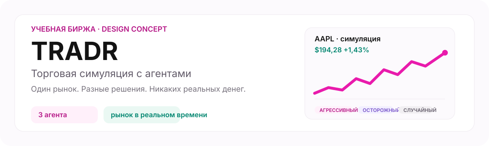
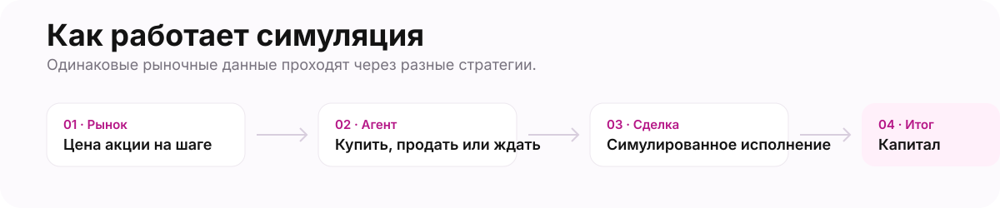

<p align="center">
  
</p>

<p align="center">
  <a href="#быстрый-старт">Быстрый старт</a> · <a href="#возможности">Возможности</a> · <a href="#как-устроен-проект">Архитектура</a> · <a href="#документация">Документация</a> · <a href="https://github.com/Hqzdev/tradr">GitHub</a>
</p>

## Учебная торговая среда с автономными агентами

TRADR — full-stack симулятор рынка. Пользователь начинает со 100 000 учебных
долларов, задаёт цель, распределяет капитал между агентами и наблюдает, как
они самостоятельно покупают и продают акции. Ручной торговли нет: каждое
действие связано с агентом и имеет понятное объяснение.

Проект предназначен для обучения и экспериментов. Он не использует реальные деньги и не является инвестиционной рекомендацией.

## Возможности

- Обзор: общий капитал, прибыль или убыток, резерв и прогресс к цели +10%.
- Рынок: 18 учебных акций, свечи, индексы и WebSocket-обновления.
- Агенты: отдельные кошельки и позиции, три стратегии и полный цикл покупки и продажи.
- Контроль: запуск, пауза, изменение бюджета и безопасное закрытие агента.
- Прозрачность: история сделок, комиссия, причина решения и кривая капитала.

## Техническое задание

Этот раздел описывает продукт как единое ТЗ для разработки. Он фиксирует
границы системы, обязательные пользовательские сценарии, правила денег и
критерии готовности. Если описание ниже расходится с текущим кодом, разделы
«Что уже работает» и «Ограничения» имеют приоритет над будущими задачами.

### 1. Цель продукта

TRADR должен дать пользователю безопасную учебную среду, в которой можно
наблюдать за решениями автономных торговых агентов, понимать связь между
рыночными данными, риском и результатом и проверять разные стратегии без
реальных платежей, брокерских счетов и вывода средств.

Главный пользовательский результат — не обещание прибыли, а объяснимый цикл:

```text
данные рынка → анализ агента → решение → заявка → сделка → изменение позиции
→ пересчёт капитала → запись объяснения и результата
```

Каждое действие, которое меняет учебный капитал или состояние агента, должно
быть связано с владельцем аккаунта, иметь серверную проверку и оставлять
аудируемый след.

### 2. Границы проекта

Входит в продукт:

- регистрация, вход и защищённые пользовательские аккаунты;
- один учебный счёт на пользователя с резервом и общей целью капитала;
- агенты с отдельными кошельками, позициями, стратегиями и журналом решений;
- синтетический рынок, котировки, свечи, индексы и поток обновлений;
- расчёт заявок, комиссии, позиции, сделки, take-profit, stop-loss и cooldown;
- Dashboard, Market, Agents, History и отдельные разделы Settings;
- REST API для команд и WebSocket для рыночных/активностных обновлений;
- PostgreSQL как источник истины и Flyway для версионирования схемы.

Не входит в продукт без отдельного согласования:

- реальные деньги, пополнение, вывод и платёжные карты;
- подключение брокера и отправка настоящих биржевых ордеров;
- инвестиционные рекомендации или гарантия результата;
- ручная торговля в обход агента и его ограничений;
- передача учебного капитала между разными пользователями;
- хранение секретов, паролей или API-ключей во frontend.

### 3. Термины и основные сущности

| Сущность | Ответственность |
| --- | --- |
| User | Учётная запись, email, пароль и профиль пользователя. |
| Account | Единственный учебный счёт пользователя: резерв, стартовый капитал, валюта, цель и ускорение. |
| Agent | Автономный участник симуляции со стратегией, статусом и принадлежностью к Account. |
| AgentWallet | Деньги конкретного агента; только он может оплачивать его заявки и позиции. |
| AgentPosition | Открытая позиция агента по инструменту и её текущая учебная стоимость. |
| Order | Намерение совершить операцию с типом, стороной, количеством, ценой и источником. |
| Trade | Исполненная операция с комиссией, временем и итоговой стоимостью. |
| AgentDecisionLog | Объяснение: что агент анализировал, какое действие выбрал и какие правила проверил. |
| Instrument | Учебный рыночный инструмент с тикером, валютой, котировкой и свечами. |
| Account settings | Сохранённые пользовательские предпочтения и defaults, которые не заменяют доменные правила. |

### 4. Функциональные требования

#### 4.1. Аутентификация и аккаунт

- Пользователь может зарегистрироваться, войти, обновить access token и выйти.
- Пароли хранятся только в виде стойкого hash. В ответах и логах нет паролей,
  refresh-токенов, секретов JWT или данных платёжных инструментов.
- Каждый защищённый запрос получает `userId` из JWT/Authentication, а не из
  тела запроса. Пользователь не видит и не изменяет чужой Account, Agent или
  историю.
- Регистрация создаёт пользователя, учебный счёт, стартовый агент и связанные
  настройки атомарно. Если одна часть не создана, не остаётся частичного
  аккаунта.
- Денежные поля используют `BigDecimal` и масштаб 2. Для идентификаторов и
  внешних связей используются UUID.

#### 4.2. Dashboard

Dashboard показывает минимум:

- общий учебный капитал;
- текущий резерв аккаунта;
- стоимость кошельков и открытых позиций агентов;
- прибыль/убыток относительно стартового капитала;
- цель капитала и прогресс к ней;
- статус агентов и следующий понятный шаг пользователя;
- ленту последних решений, сделок и изменений состояния.

Числа на Dashboard рассчитываются из одного согласованного среза данных. UI не
суммирует несовместимые ответы самостоятельно и показывает время последнего
успешного обновления.

#### 4.3. Рынок

- Синтетический провайдер выдаёт воспроизводимые учебные котировки по текущему
  набору инструментов.
- Экран рынка показывает тикер, цену, изменение, свечи, индекс, время котировки
  и состояние WebSocket-соединения.
- Рыночные данные не дают пользователю кнопку ручной покупки. Рынок — источник
  анализа для агентов.
- При недоступности потока UI сообщает последнее известное время и состояние
  данных, а не выдаёт устаревшую цену за актуальную.
- Будущий live-провайдер должен быть отдельной реализацией общего контракта,
  иметь кэш и rate limit и не менять учебный баланс без отдельного решения.

#### 4.4. Агенты

- Агент имеет имя, стратегию, статус, отдельный кошелёк, позиции и журнал
  решений.
- Базовые стратегии отличаются поведением, но ни одна стратегия не получает
  гарантированную прибыль.
- Состояния агента должны быть явными: активен, на паузе, ошибка и будущие
  состояния вроде исчерпанного бюджета или завершённого агента.
- Создание, запуск, пауза, изменение бюджета и завершение доступны только
  владельцу аккаунта и проходят серверную проверку.
- Закрытие агента с открытыми позициями сначала выполняет определённый
  безопасный сценарий закрытия, затем фиксирует результат и сохраняет историю.

#### 4.5. Торговый цикл

Каждая заявка проходит последовательность:

1. агент выбирает действие на основе данных рынка и своей стратегии;
2. backend проверяет владельца, статус агента, кошелёк, риск, лимит позиции,
   цену, количество и комиссию;
3. `OrderCalculator` рассчитывает денежные значения без плавающей арифметики;
4. `TradingService` атомарно меняет кошелёк, позицию и результат сделки;
5. создаются `Trade` и `AgentDecisionLog`;
6. Dashboard/History получают обновление с тем же идентификатором операции.

Нельзя допускать отрицательный баланс, продажу чужой позиции, повторное
исполнение одной заявки, изменение уже исполненной сделки или обход stop-loss,
take-profit и cooldown через повторный HTTP-запрос.

#### 4.6. Настройки аккаунта

Раздел настроек состоит из семи самостоятельных экранов. Настройки должны
сохраняться на backend, загружаться при открытии страницы и иметь состояния
`loading`, `dirty`, `saving`, `saved` и `error`. Локальное состояние формы не
является источником истины.

**Профиль**

- имя, никнейм, email, фото, bio и опыт торговли;
- уникальность никнейма проверяется сервером;
- смена email требует подтверждения нового адреса;
- изменение профиля не меняет токены, баланс или историю сделок.

**Уведомления**

- все сделки агентов;
- закрытие позиции в минус;
- browser push;
- ежедневная сводка и еженедельный email-отчёт;
- ценовые алерты по избранным тикерам;
- уведомления о высокой волатильности.

Доставка должна быть идемпотентной: повторная попытка worker не создаёт дубль.
Торговая транзакция публикует событие, а email/push отправляются отдельно и
могут повториться с backoff.

**Безопасность**

- смена пароля с проверкой текущего пароля и отзывом старых refresh-сессий;
- настройка и подтверждение 2FA с одноразовыми recovery-кодами;
- passkey/WebAuthn для Face ID/Touch ID без хранения приватного ключа;
- список активных сессий с отзывом выбранной сессии;
- история входов с безопасными метаданными и пагинацией.

**Торговля**

- лимит риска на сделку от 1 до 10%;
- тип ордера по умолчанию: рыночный или лимитный;
- ручное подтверждение подготовленной заявки;
- автопауза при просадке более 15%.

Эти значения являются defaults для будущих решений/агентов. Они не переписывают
уже исполненные ордера и не могут отменить бюджет, комиссию или доменные
ограничения.

**Данные**

- источник котировок: симуляция TRADR, задержка 15 минут или live beta;
- глубина истории: 30 дней, 90 дней, год или всё время;
- хранение истории дольше 12 месяцев;
- CSV-выгрузка истории сделок и журнала агентов.

Экспорт ограничивается текущим пользователем, потоково формируется на backend,
экранирует CSV-значения от formula injection и не загружает весь результат в
память браузера.

**Отображение**

- базовая валюта, язык, часовой пояс, формат чисел и тема;
- backend хранит канонические значения: ISO-код валюты и IANA timezone;
- форматирование выполняется едиными `Intl.NumberFormat` и
  `Intl.DateTimeFormat`, а не локальными шаблонами компонентов;
- смена валюты не создаёт ложную конвертацию без проверенного FX-источника.

**Метрики**

- видимость капитала под управлением;
- средняя доходность;
- общее число сделок;
- число активных агентов;
- интервал обновления: real time, минута или 5 минут;
- benchmark: без сравнения, S&P 500 или NASDAQ 100.

Метрики и benchmark должны считаться за один период и возвращать источник,
время среза и статус свежести. При отсутствии данных показывается «нет данных»,
а не нулевой результат.

### 5. Архитектурные требования

#### Frontend

- Next.js App Router и TypeScript.
- Экран отвечает за композицию и состояние интерфейса, а не за доменные
  расчёты, доступ к базе или проверку прав.
- Компоненты должны иметь одну ответственность: форма, таблица, карточка,
  форматтер и data hook не объединяются в один монолитный экран.
- Повторяющиеся запросы и модели выносятся в типизированный API-слой.
- Для новых UI-иконок используется существующая библиотека проекта.
- Загрузка, пустое состояние, ошибка, disabled и успешное сохранение должны
  быть видимыми и доступными с клавиатуры.

#### Backend

- Spring Boot разделён на domain, application, repository и web/dto.
- Контроллеры принимают/возвращают DTO и не содержат бизнес-правила.
- Application services координируют use case; domain-модели защищают свои
  инварианты через методы, а не публичные setters.
- Repository отвечает за persistence, provider — за внешние данные, mapper —
  за преобразование ответа.
- Сервисы не должны зависеть от конкретного внешнего поставщика, если можно
  определить интерфейс и адаптер.

#### Данные и миграции

- PostgreSQL — единственный источник истины для пользовательских и торговых
  данных.
- Каждое изменение схемы — новая миграция Flyway. Применённые миграции нельзя
  переписывать.
- На внешних ключах и часто используемых выборках создаются индексы.
- Для каждой настройки заранее определяются default, nullable, диапазон,
  enum-ограничение, владелец и политика удаления.
- Денежные операции выполняются в транзакции и сохраняют целостность общей
  суммы учебного капитала.

### 6. API-правила

- Базовый путь: `/api/v1`.
- Защищённые запросы используют `Authorization: Bearer <access-token>`.
- Некорректные данные возвращают понятный 4xx-ответ с машинным кодом ошибки.
- Сервер возвращает только данные, доступные текущему пользователю.
- PATCH-операции должны быть идемпотентными и не изменять поля, которых нет в
  контракте.
- Долгие операции возвращают состояние или поток прогресса, а не блокируют
  HTTP-запрос на неопределённое время.
- WebSocket-событие содержит тип, время, идентификатор сущности и версию либо
  последовательность, чтобы клиент мог обнаружить пропуск.

Минимальные существующие группы API:

```text
/api/v1/auth/*          регистрация, вход и токены
/api/v1/dashboard       агрегированный обзор аккаунта
/api/v1/account/*       настройки учебного счёта
/api/v1/agents/*        агенты, бюджеты, решения и позиции
/api/v1/market/*        инструменты, котировки и свечи
/api/v1/trading/*       заявки и сделки учебного движка
```

При добавлении новой функции сначала фиксируются request/response DTO,
коды ошибок, права доступа, транзакционная граница и обратная совместимость.

### 7. Безопасность и инварианты

- Нельзя доверять значениям из браузера: risk, budget, price, quantity,
  accountId и agentId повторно проверяются на backend.
- Изоляция пользователя проверяется во всех query/repository методах, а не
  только в контроллере.
- JWT-секрет, пароль базы, ключи поставщиков и VAPID-секреты находятся только
  в окружении backend.
- Логи не содержат access/refresh-токены, пароли, полные платёжные данные и
  лишние персональные данные.
- Денежная операция должна быть атомарной и повторно безопасной при retry.
- Любое изменение критичных настроек можно связать с пользователем, временем
  и результатом операции.
- Ошибка внешнего провайдера не должна останавливать расчёт учебных сделок или
  превращать устаревшие данные в «реальные».

### 8. Критерии готовности функции

Функция считается готовой, если:

1. описан пользовательский сценарий и негативные сценарии;
2. frontend имеет loading/empty/error/success-состояния;
3. backend валидирует вход и проверяет владельца сущности;
4. модель данных и Flyway-миграция согласованы;
5. бизнес-правила покрыты unit-тестами;
6. HTTP-контракт покрыт integration-тестами;
7. заметный UI проверен в desktop и mobile состояниях;
8. `git diff --check`, web tests, backend tests и production build проходят;
9. обновлены документация, changelog и описание известных ограничений;
10. в diff нет секретов, заглушек, мёртвого кода и случайных файлов окружения.

### 9. Приёмочные сценарии

- Новый пользователь регистрируется и видит только свой учебный счёт и первого
  агента.
- Агент принимает решение, совершает допустимую сделку, а Dashboard, History,
  wallet и decision log показывают согласованный результат.
- Недостаточный баланс, чужой агент, отрицательная сумма, неизвестный enum и
  просроченный токен получают отказ без изменения данных.
- Повтор запроса после сетевой ошибки не удваивает сделку, уведомление,
  перевод средств или экспорт.
- Изменение настроек загружается после нового входа, применяется только там,
  где это разрешено, и не меняет прошлую историю.
- При отключённом канале уведомлений и недоступном market provider интерфейс
  показывает честное состояние без скрытого fallback.
- Пользователь может восстановить понятное состояние после refresh, logout,
  закрытия вкладки и повторного подключения WebSocket.

### 10. Что уже работает и что планируется

Уже работает: авторизация, учебный счёт, Dashboard, синтетический рынок,
агенты с кошельками и позициями, сделки, комиссии, decision log, WebSocket и
базовое изменение цели/ускорения аккаунта.

Отдельно описаны как будущие задачи: кастомные агенты, риск-профили акций,
команды агентов, Time Skip, сценарий нулевого бюджета, расширенные настройки,
Google-вход и live-котировки. Подробные шаги находятся в [документации задач](./apps/web/lib/docs/content.ts)
и доступны в интерфейсе по адресу `/docs` после запуска frontend.

<p align="center">
  
</p>

## Быстрый старт

### Что потребуется

- Node.js 20 или новее;
- Java 21;
- Docker и Docker Compose для PostgreSQL.

### Первый запуск

```bash
# 1. Подготовьте переменные окружения.
cp apps/backend/.env.example apps/backend/.env
cp apps/web/.env.example apps/web/.env.local

# 2. В apps/backend/.env задайте надёжный JWT_SECRET длиной не менее 32 символов.

# 3. Запустите базу данных.
docker compose -f apps/backend/docker-compose.dev.yml up -d

# 4. Установите зависимости один раз из корня.
npm install

# 5. Запустите фронтенд и бэкенд вместе.
npm run dev
```

После запуска:

- фронтенд: [http://localhost:3000](http://localhost:3000);
- бэкенд: [http://localhost:8080](http://localhost:8080);
- проверка состояния бэкенда: [http://localhost:8080/health](http://localhost:8080/health).

Для запуска по отдельности доступны `npm run dev:web` и `npm run dev:backend`.

## Как устроен проект

```text
tradr/
├── apps/
│   ├── web/          # Next.js: пользовательский интерфейс
│   └── backend/      # Spring Boot: API, рынок, торговля, агенты
├── design/           # Pen-макеты, экспорт экранов и визуальные материалы
├── qa/               # сценарии и результаты проверок интерфейса
├── ARCHITECTURE.md   # границы модулей и обмен данными
├── DEVELOPMENT.md    # локальная разработка и команды
└── CONTRIBUTING.md   # правила внесения изменений
```

Frontend обращается к REST API по адресу `http://localhost:8080/api/v1` и
получает котировки через WebSocket. Backend хранит данные в PostgreSQL и
применяет миграции Flyway V1–V15 при запуске.

## Документация

- [Локальная разработка](./DEVELOPMENT.md) — окружение, команды и диагностика.
- [GitHub-репозиторий](https://github.com/Hqzdev/tradr) — ветки, Pull Request и история изменений.
- [Архитектура](./ARCHITECTURE.md) — ответственность слоёв и поток данных.
- [Участие в проекте](./CONTRIBUTING.md) — как подготовить изменение.
- [Безопасность](./SECURITY.md) — работа с секретами и сообщения об уязвимостях.
- [История изменений](./CHANGELOG.md) — заметные обновления проекта.
- [Документация бэкенда](./apps/backend/docs/00-overview.md) — модель данных, API и план развития.
- [Макет в Pen](./design/design.pen) — исходник экранов и компонентов.

## Ограничения

Котировки сейчас синтетические. Реальный рыночный провайдер ещё не реализован,
поэтому переменная с API-ключом сама по себе не включит настоящие цены.
Проект не использует реальные деньги и не является инвестиционной рекомендацией.
